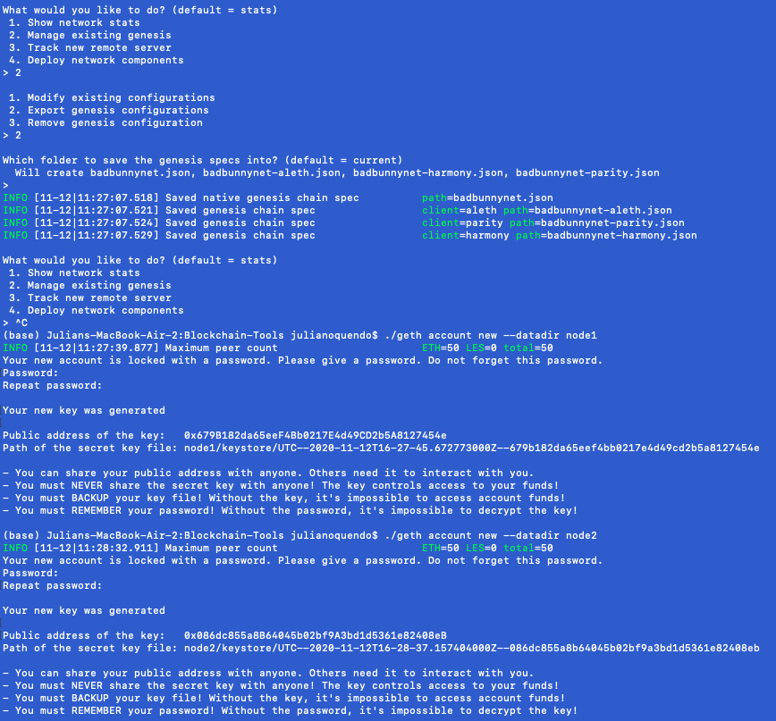

# Creating a Blockchain Testnet

### Step 1: Creating The Genesis Block
#### In order to create the Genesis Block, we had to use the Puppeth wizard from GETH. Running through the steps and prompts, we were able to get to the most important step...Choosing a name for your network. Because I happened to be listening to Bad Bunny at the time, I decided to name my network "badbunnynet"...

### Step 2: Creating Both Nodes
#### Without nodes, this networkk would be pointless. In order to activate the blockchain, we have to create a minimum of two nodes. Following the prompts, we were able to create Node 1 & Node 2: ./geth account new --datadir node1 

#### At this point, we also saved both the public and private kest generated for each respective node.

### Step 3: Initializing The Nodes
#### At this point, it was time to get both nodes up and running. This is arguably the most important part of the entire process: Getting the nodes to syn with one another and create a functioning blockchain. While I ran into a few issues, eventually we got it all figured it out. We used the following command ot get Node 1 up and running: ./geth init badbunnynet.json --datadir node1

#### And Node 2, which was a little more complicated... ./geth --datadir node2 --port 30304 --rpc --bootnodes "enode://cd1948fb98f4e64d43b29c73581573ecc3006e8bb6ec6564eeeac6e99c9a227109b52d9d23e495200ccba1a46c3e67df81400f3f9dd4a151e6bae4a10faa3076@127.0.0.1:30303"

### Step 4: Create The New Network On MCW
#### Now that we had the nodes running the blockchian, it was time to get our MyCryptoWallet on the network too. After creating a custom network on MCW, I was suddenly very wealthy with fake Ether and ready to test a transaction out:

### Step 5: Test Out badbunnynet With A Transaction
#### The last step was to send a transaction, so I went ahead and sent 1,000 Ether to myself and hoped for the best...It worked!

### Looks like badbunnynet is a massive success!

